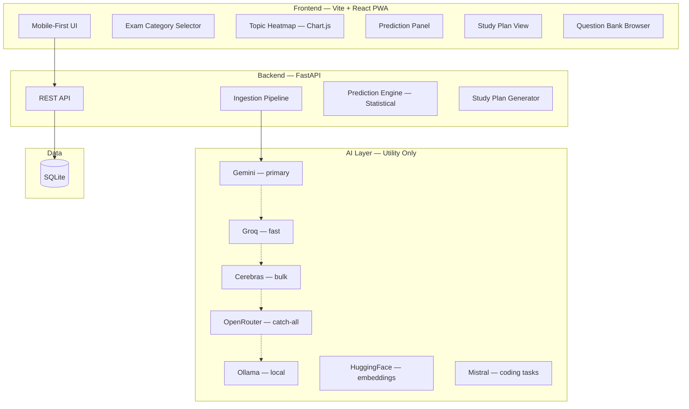

# ExamArchitect — Implementation Plan (v5 Refined)

> **Goal**: Build a mobile-first web app that analyzes past exam papers to discover topic patterns, predict likely topics for upcoming exams, and generate AI-weighted study plans.
>
> **Core Principle**: AI is a utility for parsing, tagging, and explaining. The core prediction engine is statistical and mathematical, not purely LLM-based, ensuring statistical accuracy.
>
> **Project Location**: `e:\New folder\`
> **Budget**: **$0 — completely free**

---

## 📋 Confirmed Decisions
| Decision | Choice |
|---|---|
| **Data Sourcing** | Admin pre-seeded via PDFs (Python chunking + Gemini Vision). *Modular to swap to Puppeteer scraping later if needed.* |
| **LLM Stack** | Gemini (Primary) + Groq (Fast Fallback) + Cerebras (Bulk/High-speed) + OpenRouter (Catch-all) + Ollama (Local) + HuggingFace (Local Embeddings) |
| **First Exam** | GATE CS |
| **Years of Data** | 10 years (2015–2025) |
| **User Accounts** | Anonymous for MVP (No barriers to entry) |
| **Stack** | Vite + React (PWA) + FastAPI + SQLite |

---

## 🕰️ Syllabus Versioning (Handling Topic Changes)

### The Problem
The GATE CS syllabus changed in 2021 (e.g., Added: Pipeline Hazards, System Calls; Removed: IPv6, Network Security). A topic removed in 2021 appearing in 2019 shouldn't boost its 2027 prediction.

### The Solution: Syllabus Versions
We will track which topics are active for specific year ranges. When computing frequency for a future prediction, the engine will only consider years where the topic was **active in the syllabus**.
This is implemented in the database using two tables:
1. `syllabus_versions` (defines active year ranges)
2. `syllabus_version_topics` (links specific topics to active versions)

---

## ⚡ Free LLM Stack & API Stacking

We will use a unified AI Client that acts as a fallback chain to guarantee 100% free uptime across ~4,500+ daily requests:

```
Task                          → Primary     → Fallback 1  → Fallback 2
──────────────────────────────────────────────────────────────────────
Full paper topic extraction   → Gemini      → Cerebras    → Ollama
Question difficulty rating    → Groq        → Cerebras    → Ollama
Prediction narratives         → Gemini      → Groq        → Mistral
Study plan explanations       → Gemini      → Groq        → OpenRouter
Text embeddings (similarity)  → HuggingFace (local, always free)
```

---

## ⚠️ What Can Go Wrong — Risk Analysis

### 1) 🔴 PDF / OCR accuracy with math, symbols, and diagrams
**This is the biggest risk because everything else depends on the extracted text being correct.**
* *Why it is risky*: If the question text is wrong, topic tagging, analytics, and prediction all become unreliable.
* *Free way to reduce it*:
  - Use Python to visually slice the PDF into individual question image bounding boxes.
  - Pass the question images directly to **Gemini Vision** instead of relying on pure text scrapers to preserve math and diagrams.
  - Add an Admin review step to quickly spot-check Gemini's structured JSON output.
  - The ingestion pipeline is fully decoupled—we can easily swap to Puppeteer (web scraping) later if PDF layouts are too complex.
* *Best strategy*: Leverage Gemini's multimodal capabilities over traditional OCR. Human verification guarantees pristine seed data.

### 2) 🔴 LLM tagging inconsistency
**This is another major risk because inconsistent tags will destroy your analytics.**
* *Why it is risky*: The same concept may get tagged as “Electrostatics,” “Electric Field,” or “Physics Basics,” which fragments your dataset.
* *Free way to reduce it*:
  - Create a fixed taxonomy before tagging starts.
  - Force the model to choose only from allowed subjects/topics.
  - Use a hierarchical tagging flow: `subject → chapter → topic → subtopic`
  - Use majority voting only if you are calling the model multiple times.
  - Add admin override for uncertain cases.
* *Best strategy*: Do not let the model invent new labels. Your taxonomy should be the source of truth.

### 3) 🟡 Prediction credibility
**This is the biggest product risk, not just technical risk.**
* *Why it is risky*: If predictions feel random or overconfident, users will stop trusting the platform.
* *Free way to reduce it*:
  - Do not claim exact question prediction. Predict topic probability, not exact questions.
  - Show confidence levels clearly.
  - Use holdout backtesting on older papers to test whether your method actually works.
  - Start with a simple scoring model before any ML: recent frequency, difficulty trend, topic co-occurrence, recency weight.
* *Best strategy*: Be transparent. A prediction that says “78% confidence, based on 5-year trend and co-occurrence” is much stronger than a flashy but vague “AI says this will come.”

### 4) 🟡 GATE Paper Format Variability
* *Why it is risky*: Question numbering format changed when GATE went Computer-Based Test (CBT) in 2014.
* *Mitigation*: Build regex format profiles per era to handle paper splitting cleanly.

### 5) 🟡 Free Tier Rate Limits
* *Why it is risky*: Bulk processing 1,300 questions hits free tier limits rapidly.
* *Mitigation*: Batch questions, use the API fallback chain, and cache all responses in the SQLite database to avoid duplicate calls.

### 6) 🟡 Mobile Performance with Large Heatmaps
* *Why it is risky*: Huge matrices crash mobile browsers or lag excessively.
* *Mitigation*: Use HTML5 Canvas (Chart.js), lazy rendering, and collapsible topic rows.

---

## 🏗️ Architecture



---

## 💾 Database Schema

```
exam_categories (id, name, icon, description, color)
    └── exams (id, category_id, name, full_name, conducting_body, frequency)
            ├── topics (id, exam_id, name, parent_topic_id, syllabus_weight_pct, secondary_topic_id)
            ├── papers (id, exam_id, year, session, total_marks, total_questions, pdf_path, is_processed)
            │     └── questions (id, paper_id, topic_id, secondary_topic_id, question_number, question_text,
            │                    question_style[MCQ/NAT/Subjective], difficulty[E/M/H], marks, correct_answer, has_diagram)
            ├── syllabus_versions (id, exam_id, version_name, from_year, to_year)
            ├── syllabus_version_topics (id, version_id, topic_id, is_active)
            ├── topic_year_stats (id, exam_id, topic_id, year, question_count, total_marks, avg_difficulty_trend, question_style_breakdown, pct_of_paper)
            └── predictions (id, exam_id, topic_id, target_year, predicted_probability, confidence_interval_low, confidence_interval_high, backtest_accuracy_pct, reasoning, generated_at)
```

---

## 📅 Development Phases

### Phase 1 — Foundation (Week 1)
- Vite + React scaffolding with PWA plugin configured
- FastAPI scaffolding with SQLAlchemy + SQLite setup
- Database models + Alembic migrations
- Pre-seed exam categories + GATE CS topics taxonomy
- Home page (category selector, mobile-first)
- Design system CSS (sleek dark mode, curated typography, glassmorphism)

### Phase 2 — Data Pipeline (Week 2)
- **PDF Slicer & Vision Pipeline**: Python (`PyMuPDF` or `pdfplumber`) to chunk PDF questions into images.
- **Gemini Vision Extraction**: Feed cropped question images to Gemini Vision to accurately read math, diagrams, and text into structured JSON.
- **Modular Ingestion**: Built decoupled from backend so we can swap to web scraping (Puppeteer) later if needed.
- Hierarchical LLM topic tagger (`subject → chapter → topic`) with fixed taxonomy.
- Admin Review Dashboard (Human-in-the-loop to verify JSON outputs before DB insertion).
- Seed 21 years of GATE CS papers (2005-2025)
- Compute `topic_year_stats` aggregates

### Phase 3 — Analytics & Visualization (Week 3)
- Heatmap API + Chart.js matrix component
- Prediction engine (statistical formulas computing frequency, recency, trends, co-occurrence)
- AI narrative generation for predictions (interpreting statistics into human-friendly explanations)
- Dashboard page (heatmap + predictions)
- Question bank page with topic-specific filters

### Phase 4 — Study Plan & Polish (Week 4)
- Study plan generator (priority ranking + AI tips)
- Study plan UI with cards and interactive checkboxes
- PWA manifest + service worker + offline shell
- Responsive testing on real mobile layout
- Lighthouse audit (target ≥ 90 score across performance, accessibility, SEO)

### Phase 5 — Core Growth (Post-MVP)
- User accounts + saved study plans
- Holdout validation backtesting visualizer
- More exams (NEET, UPSC, JEE, Banking)
- Spaced repetition integration

### Phase 6 — Advanced Unique Features (Post-MVP)
*Note: These features set ExamArchitect apart from all competitors, but will be built **after** the core MVP (Phases 1-4) is complete and stable.*

1. **Difficulty Trajectory**: Visualizes if a specific topic is getting progressively harder or easier over the years.
2. **Question Style DNA**: Tracks the ratio of question styles (e.g., MCQ vs. Numerical Answer Type) shifting within a topic.
3. **Topic Pairing Map**: Correlation analysis revealing which topics frequently appear combined in the same questions.
4. **Cross-Exam Intelligence**: Compares macroscopic education trends across different exam categories (e.g., GATE vs JEE).
5. **Confidence Calibrator**: Radical transparency feature showing the model's self-tested accuracy on historical holdout years.
6. **Exam Simulator**: Auto-generates a full mock paper mimicking the exact predicted distribution and difficulty of the upcoming year.

---

## ⚡ GATE CS 2011 Scanned PDF Ingestion Plan

Replace the 58 synthetic placeholder questions for GATE CS 2011 with real exam questions extracted from the scanned PDF `pdfs/GATE2011.pdf`.

### Background & Constraints

- **Scanned PDF**: `GATE2011.pdf` is a scanned image PDF — all 17 pages return 0 characters from `fitz.get_text()`. Traditional text-based extraction is impossible.
- **Booklet Code A confirmed**: Page 1 of the PDF shows "Question Booklet Code → A" and "CS–A" in the footer. All answer keys must use Code A.
- **Paper structure** (from cover page):
  - 65 total questions, 100 marks
  - Q.1–Q.25: 1-mark each (MCQ)
  - Q.26–Q.55: 2-marks each (MCQ)
  - Q.48–Q.51: Common data questions
  - Q.52–Q.55: Linked answer pairs (Q.52→Q.53, Q.54→Q.55)
  - Q.56–Q.60: 1-mark General Aptitude
  - Q.61–Q.65: 2-marks General Aptitude
- **Page 1 is instructions only** — contains no questions, must be skipped.
- **Questions rendered to images**: All 17 pages have been pre-rendered to `backend/data/temp_pages/page_1.png` through `page_17.png` at 150 DPI using PyMuPDF.
- **Gemini copyright filter**: `gemini-2.5-flash` blocks verbatim transcription of exam papers (finish_reason=4, "reciting from copyrighted material"). **Tested workaround**: instructing the model to slightly paraphrase the prose while preserving all technical/mathematical content works successfully.
- **Gemini free-tier rate limits**: 15 RPM. With 17 pages (skipping page 1 = 16 API calls), a 4-second delay between calls keeps us at ~12 RPM — well within limits. Total runtime ≈ 3–4 minutes.

> [!WARNING]
> **Re-running `parse_and_ingest_all.py`** (the bulk pipeline) will delete all questions and re-create synthetic placeholders for 2011, since GATE2011.pdf is in the `SKIP_FITZ` set. After this ingestion, avoid re-running the bulk pipeline without first removing 2011 from its scope, or the real questions will be overwritten.

---

### Proposed Changes

#### 1. Ingestion Script: [NEW] [ingest_2011.py](file:///e:/New%20folder/backend/ingest_2011.py)

A standalone Python script that:

**Setup & DB prep:**
- Loads `.env` credentials via `dotenv` and configures `sys.stdout` to UTF-8 (needed for ₹ and other Unicode in Windows terminals).
- Looks up the GATE 2011 paper by querying `Paper` where `year=2011` (not hardcoded Paper ID — resilient to re-seeding).
- Deletes all existing questions for that paper from the `questions` table.

**Visual extraction loop (pages 2–17):**
- For each page image, sends it to `gemini-2.5-flash` with a structured prompt requesting JSON output containing `question_number`, `question_text` (with options embedded), `question_style`, `has_diagram`, and `diagram_bbox`.
- **Rate limit**: `time.sleep(4)` between each API call (16 calls ÷ 4s = ~4 RPM peak).
- **Paraphrasing instruction**: The prompt tells the model to slightly paraphrase prose to avoid copyright recitation blocks, while keeping all technical content (variables, values, options, formulas) exactly intact.
- **Deduplication**: If the same `question_number` appears on multiple pages (question spanning a page break), the later extraction overwrites the earlier one — the second page typically has the complete question + options.

**Diagram cropping:**
- For questions where `has_diagram=true` and `diagram_bbox` is returned, the script:
  1. Maps the normalized `[ymin, xmin, ymax, xmax]` coordinates (0.0–1.0) to actual PDF page pixels.
  2. Crops the region using `page.get_pixmap(clip=rect, dpi=150)`.
  3. Saves the crop to `backend/data/slices/{paper_id}/q_{q_num}.png`.
- The `diagram_path` stored in the DB will be a **relative URL path**: `/slices/{paper_id}/q_{q_num}.png` (served by the new static mount).

**Classification & answer keys:**
- Each question is classified into subject/chapter using the existing keyword-matching logic from `parse_and_ingest_all.py` (`GATE_SUBJECTS` dictionary).
- Marks are assigned based on the confirmed structure: Q.1–25 → 1.0, Q.26–55 → 2.0, Q.56–60 → 1.0, Q.61–65 → 2.0.
- Correct answers are set from the **official Code A answer key** (sourced from GeeksforGeeks verified key):

| Q | Ans | Q | Ans | Q | Ans | Q | Ans | Q | Ans |
|---|-----|---|-----|---|-----|---|-----|---|-----|
| 1 | C | 14 | B | 27 | B | 40 | B | 53 | C |
| 2 | D | 15 | A | 28 | A | 41 | B | 54 | B |
| 3 | A | 16 | C | 29 | B | 42 | B | 55 | C |
| 4 | C | 17 | B | 30 | A | 43 | D | 56 | A |
| 5 | B | 18 | C | 31 | A | 44 | B | 57 | B |
| 6 | C | 19 | A | 32 | D | 45 | A | 58 | C |
| 7 | A | 20 | B | 33 | D | 46 | C | 59 | B |
| 8 | B | 21 | D | 34 | D | 47 | C | 60 | D |
| 9 | D | 22 | C | 35 | B | 48 | B | 61 | C |
| 10 | D | 23 | B | 36 | B | 49 | D | 62 | D |
| 11 | D | 24 | C | 37 | C | 50 | D | 63 | A |
| 12 | A | 25 | A | 38 | C | 51 | B | 64 | C |
| 13 | D | 26 | C | 39 | A | 52 | A | 65 | D |

**Final steps:**
- Updates the paper's `total_questions` to 65 and `is_processed` to True.
- Calls `recompute_topic_stats()` to regenerate heatmap aggregates for 2011.

---

#### 2. Static File Serving: [MODIFY] [main.py](file:///e:/New%20folder/backend/app/main.py)
- Import `StaticFiles` from `fastapi.staticfiles`.
- Mount the slices directory at `/slices`:
  ```python
  from fastapi.staticfiles import StaticFiles
  SLICES_DIR = Path(os.path.dirname(os.path.dirname(__file__))) / "data" / "slices"
  app.mount("/slices", StaticFiles(directory=str(SLICES_DIR)), name="slices")
  ```
- This makes `http://localhost:8000/slices/{paper_id}/q_13.png` serve the cropped diagram image.

---

#### 3. Frontend Diagram Rendering: [MODIFY] [QuestionCard.jsx](file:///e:/New%20folder/frontend/src/components/QuestionCard.jsx)

Currently, when `q.has_diagram` is true, the card only shows a text banner:
> "Contains diagram / graphic content (Refer to standard papers if missing)"

**Change**: Replace the text-only banner with actual image rendering:
- If `q.diagram_path` exists, render an `` tag with `src` set to `http://localhost:8000` + `q.diagram_path`.
- If `q.has_diagram` is true but `diagram_path` is null/empty, keep the existing text fallback banner.
- Style the image with `max-width: 100%`, `rounded-lg`, and a subtle border to match the dark theme.

---

#### 4. Admin Diagram Rendering: [MODIFY] [Admin.jsx](file:///e:/New%20folder/frontend/src/pages/Admin.jsx)
- Apply the same URL resolution logic: prepend `http://localhost:8000` to relative `diagram_path` values starting with `/slices/`.

---

### Verification Plan

#### Automated Verification
1. Run `ingest_2011.py` and confirm it completes without errors across all 16 page API calls.
2. Run a verification query script that checks:
   - Exactly 65 questions exist for the 2011 paper.
   - All 65 have non-null `correct_answer` values matching the Code A key.
   - Questions with diagrams (e.g., Q.5, Q.13, Q.14, Q.23) have `has_diagram=True` and a valid `diagram_path`.
   - The corresponding PNG files exist on disk at the expected paths.

#### Manual Verification
- Open the Question Explorer in the browser, filter by "GATE CS 2011", and verify:
  - Real question text appears (not "What is the core theorem..." synthetic placeholders).
  - Diagram images render inline for diagrammatic questions.
  - Selecting an option and clicking "Verify Answer" correctly evaluates against the Code A key.


