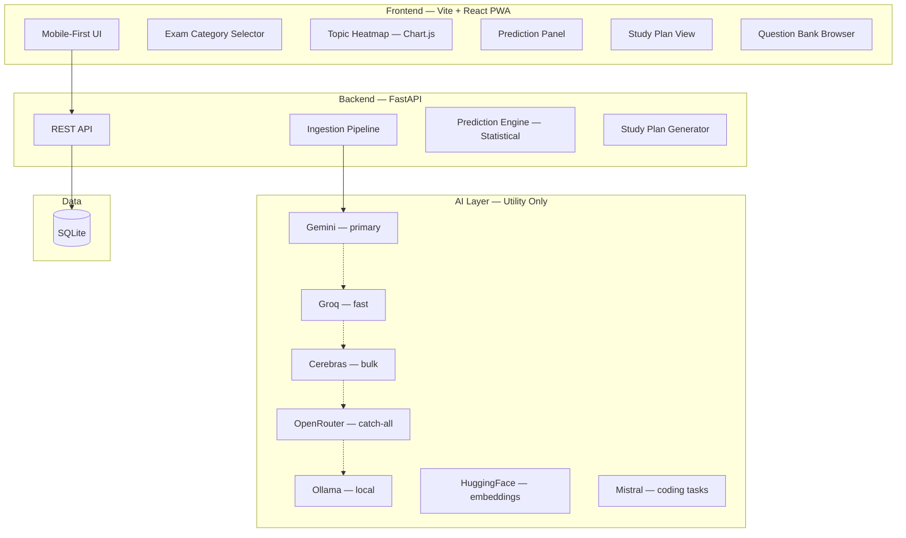

# ExamArchitect — Implementation Plan (v5 Refined)

> **Goal**: Build a mobile-first web app that analyzes past exam papers to discover topic patterns, predict likely topics for upcoming exams, and generate AI-weighted study plans.
>
> **Core Principle**: AI is a utility for parsing, tagging, and explaining. The core prediction engine is statistical and mathematical, not purely LLM-based, ensuring statistical accuracy.
>
> **Project Location**: `e:\New folder\`
> **Budget**: **$0 — completely free**

---

## 📋 Confirmed Decisions
| Decision | Choice |
|---|---|
| **Data Sourcing** | Admin pre-seeded via PDFs (Python chunking + Gemini Vision). *Modular to swap to Puppeteer scraping later if needed.* |
| **LLM Stack** | Gemini (Primary) + Groq (Fast Fallback) + Cerebras (Bulk/High-speed) + OpenRouter (Catch-all) + Ollama (Local) + HuggingFace (Local Embeddings) |
| **First Exam** | GATE CS |
| **Years of Data** | 10 years (2015–2025) |
| **User Accounts** | Anonymous for MVP (No barriers to entry) |
| **Stack** | Vite + React (PWA) + FastAPI + SQLite |

---

## 🕰️ Syllabus Versioning (Handling Topic Changes)

### The Problem
The GATE CS syllabus changed in 2021 (e.g., Added: Pipeline Hazards, System Calls; Removed: IPv6, Network Security). A topic removed in 2021 appearing in 2019 shouldn't boost its 2027 prediction.

### The Solution: Syllabus Versions
We will track which topics are active for specific year ranges. When computing frequency for a future prediction, the engine will only consider years where the topic was **active in the syllabus**.
This is implemented in the database using two tables:
1. `syllabus_versions` (defines active year ranges)
2. `syllabus_version_topics` (links specific topics to active versions)

---

## ⚡ Free LLM Stack & API Stacking

We will use a unified AI Client that acts as a fallback chain to guarantee 100% free uptime across ~4,500+ daily requests:

```
Task                          → Primary     → Fallback 1  → Fallback 2
──────────────────────────────────────────────────────────────────────
Full paper topic extraction   → Gemini      → Cerebras    → Ollama
Question difficulty rating    → Groq        → Cerebras    → Ollama
Prediction narratives         → Gemini      → Groq        → Mistral
Study plan explanations       → Gemini      → Groq        → OpenRouter
Text embeddings (similarity)  → HuggingFace (local, always free)
```

---

## ⚠️ What Can Go Wrong — Risk Analysis

### 1) 🔴 PDF / OCR accuracy with math, symbols, and diagrams
**This is the biggest risk because everything else depends on the extracted text being correct.**
* *Why it is risky*: If the question text is wrong, topic tagging, analytics, and prediction all become unreliable.
* *Free way to reduce it*:
  - Use Python to visually slice the PDF into individual question image bounding boxes.
  - Pass the question images directly to **Gemini Vision** instead of relying on pure text scrapers to preserve math and diagrams.
  - Add an Admin review step to quickly spot-check Gemini's structured JSON output.
  - The ingestion pipeline is fully decoupled—we can easily swap to Puppeteer (web scraping) later if PDF layouts are too complex.
* *Best strategy*: Leverage Gemini's multimodal capabilities over traditional OCR. Human verification guarantees pristine seed data.

### 2) 🔴 LLM tagging inconsistency
**This is another major risk because inconsistent tags will destroy your analytics.**
* *Why it is risky*: The same concept may get tagged as “Electrostatics,” “Electric Field,” or “Physics Basics,” which fragments your dataset.
* *Free way to reduce it*:
  - Create a fixed taxonomy before tagging starts.
  - Force the model to choose only from allowed subjects/topics.
  - Use a hierarchical tagging flow: `subject → chapter → topic → subtopic`
  - Use majority voting only if you are calling the model multiple times.
  - Add admin override for uncertain cases.
* *Best strategy*: Do not let the model invent new labels. Your taxonomy should be the source of truth.

### 3) 🟡 Prediction credibility
**This is the biggest product risk, not just technical risk.**
* *Why it is risky*: If predictions feel random or overconfident, users will stop trusting the platform.
* *Free way to reduce it*:
  - Do not claim exact question prediction. Predict topic probability, not exact questions.
  - Show confidence levels clearly.
  - Use holdout backtesting on older papers to test whether your method actually works.
  - Start with a simple scoring model before any ML: recent frequency, difficulty trend, topic co-occurrence, recency weight.
* *Best strategy*: Be transparent. A prediction that says “78% confidence, based on 5-year trend and co-occurrence” is much stronger than a flashy but vague “AI says this will come.”

### 4) 🟡 GATE Paper Format Variability
* *Why it is risky*: Question numbering format changed when GATE went Computer-Based Test (CBT) in 2014.
* *Mitigation*: Build regex format profiles per era to handle paper splitting cleanly.

### 5) 🟡 Free Tier Rate Limits
* *Why it is risky*: Bulk processing 1,300 questions hits free tier limits rapidly.
* *Mitigation*: Batch questions, use the API fallback chain, and cache all responses in the SQLite database to avoid duplicate calls.

### 6) 🟡 Mobile Performance with Large Heatmaps
* *Why it is risky*: Huge matrices crash mobile browsers or lag excessively.
* *Mitigation*: Use HTML5 Canvas (Chart.js), lazy rendering, and collapsible topic rows.

---

## 🏗️ Architecture



---

## 💾 Database Schema

```
exam_categories (id, name, icon, description, color)
    └── exams (id, category_id, name, full_name, conducting_body, frequency)
            ├── topics (id, exam_id, name, parent_topic_id, syllabus_weight_pct, secondary_topic_id)
            ├── papers (id, exam_id, year, session, total_marks, total_questions, pdf_path, is_processed)
            │     └── questions (id, paper_id, topic_id, secondary_topic_id, question_number, question_text,
            │                    question_style[MCQ/NAT/Subjective], difficulty[E/M/H], marks, correct_answer, has_diagram)
            ├── syllabus_versions (id, exam_id, version_name, from_year, to_year)
            ├── syllabus_version_topics (id, version_id, topic_id, is_active)
            ├── topic_year_stats (id, exam_id, topic_id, year, question_count, total_marks, avg_difficulty_trend, question_style_breakdown, pct_of_paper)
            └── predictions (id, exam_id, topic_id, target_year, predicted_probability, confidence_interval_low, confidence_interval_high, backtest_accuracy_pct, reasoning, generated_at)
```

---

## 📅 Development Phases

### Phase 1 — Foundation (Week 1)
- Vite + React scaffolding with PWA plugin configured
- FastAPI scaffolding with SQLAlchemy + SQLite setup
- Database models + Alembic migrations
- Pre-seed exam categories + GATE CS topics taxonomy
- Home page (category selector, mobile-first)
- Design system CSS (sleek dark mode, curated typography, glassmorphism)

### Phase 2 — Data Pipeline (Week 2)
- **PDF Slicer & Vision Pipeline**: Python (`PyMuPDF` or `pdfplumber`) to chunk PDF questions into images.
- **Gemini Vision Extraction**: Feed cropped question images to Gemini Vision to accurately read math, diagrams, and text into structured JSON.
- **Modular Ingestion**: Built decoupled from backend so we can swap to web scraping (Puppeteer) later if needed.
- Hierarchical LLM topic tagger (`subject → chapter → topic`) with fixed taxonomy.
- Admin Review Dashboard (Human-in-the-loop to verify JSON outputs before DB insertion).
- Seed 21 years of GATE CS papers (2005-2025)
- Compute `topic_year_stats` aggregates

### Phase 3 — Analytics & Visualization (Week 3)
- Heatmap API + Chart.js matrix component
- Prediction engine (statistical formulas computing frequency, recency, trends, co-occurrence)
- AI narrative generation for predictions (interpreting statistics into human-friendly explanations)
- Dashboard page (heatmap + predictions)
- Question bank page with topic-specific filters

### Phase 4 — Study Plan & Polish (Week 4)
- Study plan generator (priority ranking + AI tips)
- Study plan UI with cards and interactive checkboxes
- PWA manifest + service worker + offline shell
- Responsive testing on real mobile layout
- Lighthouse audit (target ≥ 90 score across performance, accessibility, SEO)

### Phase 5 — Core Growth (Post-MVP)
- User accounts + saved study plans
- Holdout validation backtesting visualizer
- More exams (NEET, UPSC, JEE, Banking)
- Spaced repetition integration

### Phase 6 — Advanced Unique Features (Post-MVP)
*Note: These features set ExamArchitect apart from all competitors, but will be built **after** the core MVP (Phases 1-4) is complete and stable.*

1. **Difficulty Trajectory**: Visualizes if a specific topic is getting progressively harder or easier over the years.
2. **Question Style DNA**: Tracks the ratio of question styles (e.g., MCQ vs. Numerical Answer Type) shifting within a topic.
3. **Topic Pairing Map**: Correlation analysis revealing which topics frequently appear combined in the same questions.
4. **Cross-Exam Intelligence**: Compares macroscopic education trends across different exam categories (e.g., GATE vs JEE).
5. **Confidence Calibrator**: Radical transparency feature showing the model's self-tested accuracy on historical holdout years.
6. **Exam Simulator**: Auto-generates a full mock paper mimicking the exact predicted distribution and difficulty of the upcoming year.
